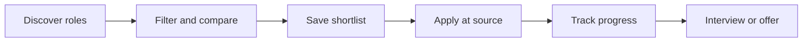

# InternWire+

> A premium internship discovery and application-tracking workspace built for students and fresh graduates.

[](https://intern-wire-plus.patelpavan7757.chatgpt.site)
[](https://react.dev/)
[](https://www.typescriptlang.org/)
[](LICENSE)

## Overview

InternWire+ turns a large internship feed into a focused job-search workflow. Users can search and filter direct-source opportunities, save promising roles, inspect job details and move applications through a simple pipeline without creating an account.

The interface uses a dark career-dashboard visual system with animated aurora lighting, a live career-pulse graphic, responsive job cards and accessible reduced-motion behavior.

**Live application:** [intern-wire-plus.patelpavan7757.chatgpt.site](https://intern-wire-plus.patelpavan7757.chatgpt.site)

## Features

- Search by role, company, keyword or location
- Filter by role type, category, work mode, source and freshness
- Sort opportunities by newest, company or role
- Save and remove opportunities from a personal shortlist
- Track applications across `To apply`, `Applied`, `Interview` and `Offer`
- Open a detailed job panel before visiting the original source
- Persist saved roles and tracker stages in browser storage
- Browse an indexed snapshot of direct-source internship listings
- Use the full workflow on desktop, tablet and mobile
- Respect the operating system's reduced-motion preference

## Product Flow



## Tech Stack

| Area | Technology |
| --- | --- |
| UI | React 19, TypeScript, Tailwind CSS 4 |
| Framework | Vinext / Next-compatible App Router |
| Components | Radix UI, Shadcn-style primitives, Lucide icons |
| Feedback | Sonner notifications |
| State | React hooks and browser `localStorage` |
| Build | Vite 8, Vinext build pipeline |
| Hosting | Cloudflare Workers-compatible Sites deployment |

## Getting Started

### Requirements

- Node.js `22.13.0` or newer
- npm

### Installation

```bash
git clone https://github.com/nitin16112004/intern-wire-plus.git
cd intern-wire-plus
npm ci
```

### Development

```bash
npm run dev
```

### Production build

```bash
npm run build
```

### Run the production build

```bash
npm run start
```

## Available Scripts

| Command | Purpose |
| --- | --- |
| `npm run dev` | Start the local development server |
| `npm run build` | Create a production build |
| `npm run start` | Run the built application |
| `npm run lint` | Run ESLint checks |
| `npm test` | Build and execute the included tests |
| `npm run install:ci` | Install the locked dependency set in the hosted build environment |

## Project Structure

```text
intern-wire-plus/
├── app/
│   ├── globals.css        # Theme, responsive styling and animations
│   ├── layout.tsx         # Metadata and root document layout
│   └── page.tsx           # Discovery, saved roles, details and tracker UI
├── components/ui/         # Reusable accessible interface primitives
├── hooks/                 # Shared React hooks
├── lib/                   # Utility helpers
├── public/
│   ├── internships.json   # Internship feed snapshot
│   └── favicon.svg
├── tests/                 # Rendering and component checks
├── worker/                # Cloudflare-compatible worker entry point
├── package.json
└── vite.config.ts
```

## Data Model

Each listing follows this shape:

```ts
type Job = {
  id?: string | number;
  source: "linkedin" | "linkedin-post" | "twitter" | "manual" | string;
  title: string;
  company?: string | null;
  location?: string | null;
  url: string;
  posted_at?: string | null;
  scraped_at?: string | null;
  snippet?: string | null;
};
```

The current deployment reads `public/internships.json`. Saved job IDs and tracker stages are device-local and do not leave the browser.

## Design System

- Ink-black background with violet, cyan and emerald signals
- Frosted surfaces and subtle gradient borders
- Animated career-pulse data graphic
- Staggered job-card entrance and hover feedback
- Touch-friendly controls and horizontally scrollable mobile tabs
- `prefers-reduced-motion` support for accessibility

## Deployment

The project builds to a Cloudflare Workers-compatible artifact. The included `.openai/hosting.json`, worker entry point and build scripts support deployment through ChatGPT Sites. The standard production build can also be adapted to another Vinext-compatible host.

## Roadmap

- Connect a scheduled scraper or API for automatic feed refreshes
- Add server-backed user accounts and cross-device saved roles
- Add eligibility filters for graduation year and degree
- Add notes, deadlines and reminders to tracked applications
- Add an admin workflow for curated opportunities

## Acknowledgements

The product concept was informed by [The Intern Wire](https://github.com/imajij/intern-wire), an open internship aggregation project. InternWire+ uses an independently built React interface and extends the concept with a shortlist, application tracker and redesigned experience.

Job titles, company names and outbound links in the bundled data snapshot belong to their respective sources. Always verify eligibility and listing validity on the original page before applying.

## License

The application code is available under the [MIT License](LICENSE). Third-party dependencies and vendored assets remain subject to their own licenses.
